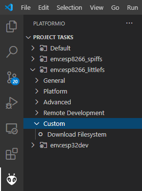

# ESP32 & ESP8266 Filesystem Downloader Plugin

## Description

This script provides functions to download the filesystem (SPIFFS or LittleFS) from a running ESP32 / ESP8266  over the serial bootloader using esptool.py, and mklittlefs / mkspiffs for extracting.

## Limitations

* only works with ESP8266 and ESP32 chips. 
* only works over the serial bootloader too, downloading the flash content via a JTAG adapter and OpenOCD is not implemented.
* for the ESP32, only SPIFFS is supported. LittleFS support is not merged in mainline Arduino-ESP32 yet as a built-in library

## Usage

The extractor can be run by either using the VSCode task "Custom" -> "Download Filesystem".



Alternatively one can execute

```
pio run -t downloadfs
```
(with optional `-e <environment>`) from a [PIO commandline](https://docs.platformio.org/en/latest/integration/ide/vscode.html#platformio-core-cli). 

## Configuration
The output will be saved, by default, in the "unpacked_fs" of the project.
This folder can be changed by writing `custom_unpack_dir = some_other_dir` in the corresponding platformio.ini environment. 

## Using in a different project

To add this extractor task functionality to your project, simply copy the `download_fs.py` of this repository to your project and add 

```ini
extra_scripts = download_fs.py
```
to the `platformio.ini`. After a VSCode restart, the new task should appear.

## This Test Firmware

This repository contains a test firwmare for both ESP8266 and ESP32 chips and the LittleFS and SPIFFS filesystem flavors. The PlatformIO environments

* `esp8266_spiffs`: ESP8266 (NodeMCUv2) + SPIFFS
* `esp8266_littlefs`: ESP8266 (NodeMCUv2) + LittleF
* `esp32dev`: ESP32 (ESP32 Dev Module C) + SPIFFS

are implemented. The `main.cpp` automatically recognizes which environment it is run in and interacts with the correct filesystem automatically.

The test firwmare programatically writes the file `hello.txt` in the filesystem with the content `Hello World!` and a suffix depending on the filesystem.

For testing of this script, please once upload the correct test firmware for your environment to the chip. 

## Example execution

As an example, an ESP8266 NodeMCUv2 board is connected to the PC. Commands are executed from the commandline.

In my case, I completely erase the flash once by manually doing 

```
python C:\Users\<user>\.platformio\packages\tool-esptoolpy\esptool.py erase_flash
```

Then, the test firmware for the ESP8266 + LittleFS combination is uploaded and monitored. 

```
pio run -e esp8266_littlefs -t upload -t monitor
```

(alternatively: Execute "Upload and Monitor" task in VSCode in correct environment)

The output at the bottom should say

```
Wrote 294720 bytes (216563 compressed) at 0x00000000 in 5.7 seconds (effective 415.2 kbit/s)...

[..]
================================ [SUCCESS] Took 15.89 seconds ================================
--- Available filters and text transformations: colorize, debug, default, direct, esp8266_exception_decoder, hexlify, log2file, nocontrol, printable, send_on_enter, time
--- More details at http://bit.ly/pio-monitor-filters
--- Miniterm on COM13  74880,8,N,1 ---
--- Quit: Ctrl+C | Menu: Ctrl+T | Help: Ctrl+T followed by Ctrl+H ---

 ets Jan  8 2013,rst cause:2, boot mode:(3,7)

load 0x4010f000, len 3584, room 16
tail 0
chksum 0xb0
csum 0xb0
v2843a5ac
~ld

Using LittleFS.
Writing file: /hello.txt
- file written
```

Press Ctrl+C to abort the monitor.

Let us now retrieve the file by doing 

```
pio run -e esp8266_littlefs -t downloadfs
```

(alternatively: execute "Custom" -> "Download Filesystem" in VSCode in correct environment)

Which should output

```
[...]
Entrypoint
Retrieving filesystem info for ESP8266.
FS_START: 0x300000
FS_END: 0x3fa000
FS_PAGE: 0x100
FS_BLOCK: 0x2000
Recognized LittleFS filesystem.
Parsed FS info: FS type FSType.LITTLEFS Start 0x300000 Len 1024000 Page size 256 Block size 8192 Tool: C:\Users\Max\.platformio\packages\tool-mklittlefs\mklittlefs
Executing flash download command.
"c:\users\max\appdata\local\programs\python\python38\python.exe" "C:\Users\Max\.platformio\packages\tool-esptoolpy@1.20800.0\esptool.py" --chip esp8266 --port "COM13" --baud 400000 --before default_reset --after hard_reset read_flash 0x300000 0xfa000 "C:\Users\Max\Documents\PlatformIO\Projects\esp32ftdi\downloaded_fs_0x300000_0xfa000.bin"
esptool.py v2.8
Serial port COM13
Connecting....
Chip is ESP8266EX
Features: WiFi
Crystal is 26MHz
MAC: 2c:3a:e8:06:17:b1
Uploading stub...
Running stub...
Stub running...
Changing baud rate to 400000
Changed.
1024000 (100 %)
1024000 (100 %)

Read 1024000 bytes at 0x300000 in 27.4 seconds (299.0 kbit/s)...
Hard resetting via RTS pin...
Downloaded filesystem binary.
Download was okay: True. File at: C:\Users\Max\Documents\PlatformIO\Projects\esp32ftdi\downloaded_fs_0x300000_0xfa000.bin
Executing extraction command: "C:\Users\Max\.platformio\packages\tool-mklittlefs\mklittlefs" -b 8192 -p 256 --unpack "unpacked_esp8266_littlefs" "C:\Users\Max\Documents\PlatformIO\Projects\esp32ftdi\downloaded_fs_0x300000_0xfa000.bin"
hello.txt        > ./unpacked_esp8266_littlefs/hello.txt        size: 27 Bytes
Unpacked filesystem.
Extracted 1 file(s) from filesystem.
```

The file `unpacked_esp8266_littlefs/hello.txt` was recovered and saved in the project folder. 

The content of the file is 

```text
> type .\unpacked_esp8266_littlefs\hello.txt
Hello from ESP8266 LittleFS
```

Just as the firmware has written it (see `main.cpp`)
